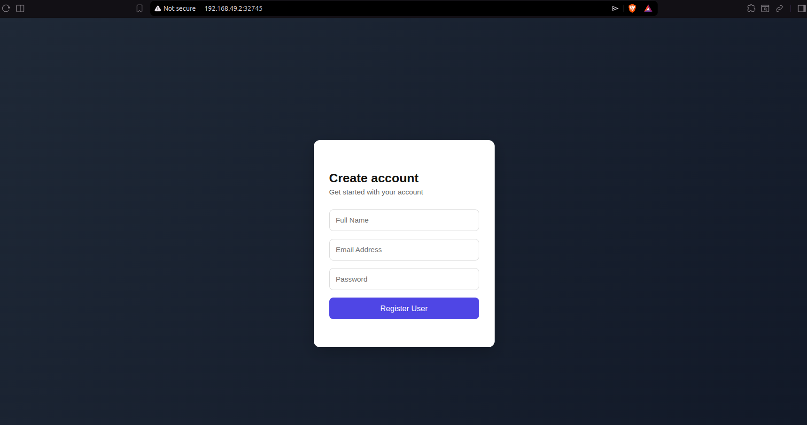
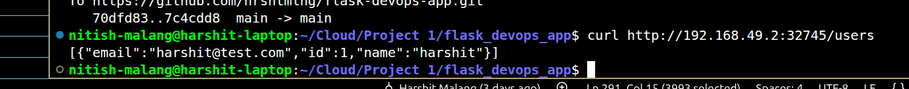
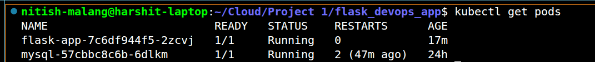
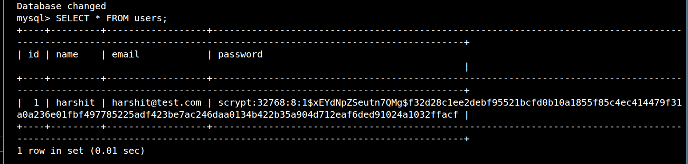

# Flask DevOps App 🚀

An end-to-end DevOps project built using Flask, Docker, Kubernetes (Minikube), Nginx, GitHub Actions CI/CD, and MySQL.

---

## Project Overview

This project demonstrates a complete DevOps workflow from local development to containerization and orchestration.

The application is containerized using Docker, deployed on Kubernetes (Minikube), connected to a MySQL database running in a separate pod, and exposed via a Kubernetes service.

It also includes a simple UI for user registration and login.

---

## Tech Stack

- Python Flask  
- Docker  
- Kubernetes (Minikube)  
- MySQL  
- Nginx  
- GitHub Actions  
- Linux (Ubuntu)  

---

## Project Architecture

```
Client → Flask App (Pod) → MySQL (Pod)
            ↓
     Kubernetes Service
```

---

## Features

- User Registration  
- User Login (with password hashing)  
- Fetch all users  
- Flask-based UI (Signup/Login)  
- MySQL database integration  
- Dockerized application  
- Kubernetes deployment (multi-pod setup)  
- CI pipeline using GitHub Actions  

---

## Folder Structure

```
.
├── .github/workflows
│   └── ci.yml
├── nginx
│   └── nginx.conf
├── templates
│   └── index.html
├── screenshots
├── app.py
├── deployment.yaml
├── mysql.yaml
├── Dockerfile
├── docker-compose.yml
├── requirements.txt
└── README.md
```

---

## Local Setup (Kubernetes)

### 1. Start Minikube

```bash
minikube start
```

### 2. Use Minikube Docker

```bash
eval $(minikube docker-env)
```

### 3. Build Docker Image

```bash
docker build -t flask-devops-app .
```

### 4. Deploy MySQL

```bash
kubectl apply -f mysql.yaml
```

### 5. Deploy Flask App

```bash
kubectl apply -f deployment.yaml
```

### 6. Access Application

```bash
minikube service flask-app
```

---

## API Endpoints

### Register
POST /register

### Login
POST /login

### Get Users
GET /users

---

## Database Setup

If the table does not exist, create it manually:

```sql
USE flask_app;

CREATE TABLE users (
    id INT AUTO_INCREMENT PRIMARY KEY,
    name VARCHAR(100),
    email VARCHAR(100) UNIQUE,
    password TEXT
);
```

---

## CI/CD Pipeline

GitHub Actions automatically:

- Builds Docker image  
- Verifies project setup  
- Runs on every push to main branch  

Workflow file:
.github/workflows/ci.yml

---

## Docker (Optional - Local Development)

```bash
docker compose up --build
```

---

## Important Commands

### Check Pods

```bash
kubectl get pods
```

### View Logs

```bash
kubectl logs <pod-name>
```

### Restart Deployment

```bash
kubectl rollout restart deployment flask-app
```

---

## How Project looks?

### UI Signup Page


Shows the Flask application signup screen used for user registration.

### API Working


Demonstrates the application API responding successfully to requests.

### Kubernetes Pods


Displays deployed Kubernetes pods for the Flask app and MySQL database.

### MySQL Database Data


Shows stored user data in the MySQL database.

---

## Learning Outcomes

- Docker containerization  
- Kubernetes deployment and services  
- Multi-pod architecture  
- Backend ↔ Database integration  
- CI/CD basics with GitHub Actions  
- Debugging real-world deployment issues  
- Linux + terminal workflow  

---

## Future Improvements

- Move credentials to Kubernetes Secrets  
- Add JWT authentication  
- Add HTTPS (SSL)  
- Production setup using Gunicorn + Nginx  
- CI/CD auto-deploy to cloud (AWS/GCP)  

---

## Author

Harshit Malang