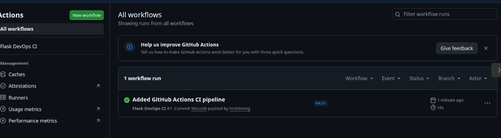
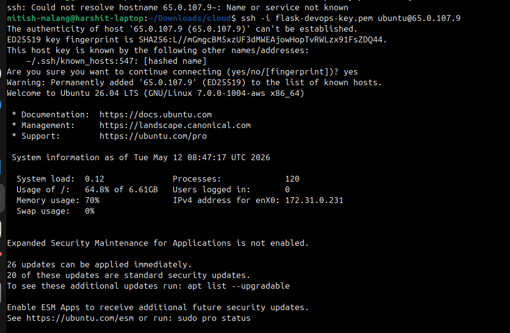
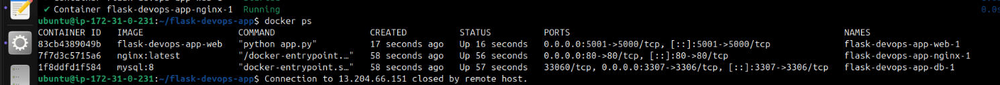
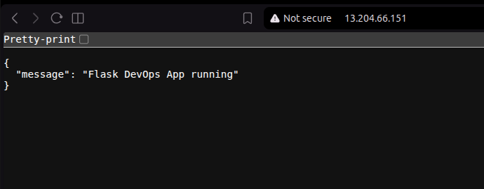
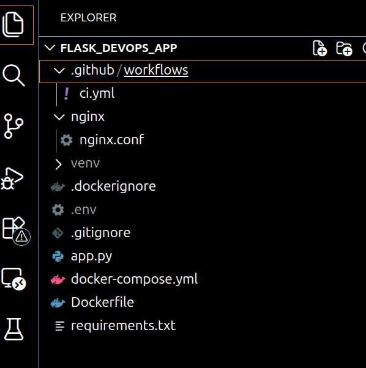

# Flask DevOps App

A end-to-end DevOps project built using Flask, Docker, Nginx, GitHub Actions CI/CD, and AWS EC2.

---

# Project Overview

This project demonstrates a complete DevOps workflow starting from local development to cloud deployment.

The application is containerized using Docker, managed using Docker Compose, reverse proxied through Nginx, tested using GitHub Actions CI pipeline, and deployed on AWS EC2.

---

# Tech Stack

- Python Flask
- Docker
- Docker Compose
- Nginx
- GitHub Actions
- AWS EC2
- Ubuntu Linux
- MySQL

---

# Project Architecture

```text
Client → Nginx → Flask App → MySQL Database
```

---

# Features

- Flask backend API
- MySQL database integration
- Dockerized application
- Multi-container setup using Docker Compose
- Nginx reverse proxy configuration
- CI pipeline using GitHub Actions
- AWS EC2 deployment
- Public IP accessibility

---

# Folder Structure

```bash
.
├── .github/workflows
│   └── ci.yml
├── nginx
│   └── nginx.conf
├── screenshots
│   ├── docker-containers.png
│   ├── ec2-ssh.png
│   ├── github-actions-success.png
│   ├── project-structure.png
│   └── public-deployment.png
├── app.py
├── docker-compose.yml
├── Dockerfile
├── requirements.txt
└── README.md
```

---

# Local Setup

## Clone Repository

```bash
git clone https://github.com/hrshtmlng/flask-devops-app.git
cd flask-devops-app
```

---

## Build and Run Containers

```bash
docker compose up --build
```

---

## Run in Detached Mode

```bash
docker compose up -d
```

---

## Check Running Containers

```bash
docker ps
```

---

# Access Application

## Local Access

```text
http://localhost
```

---

## EC2 Public Deployment

```text
http://YOUR_PUBLIC_IP
```

---

# Docker Services

## Flask App Container

Handles:
- API logic
- Backend application
- Database connection

---

## MySQL Container

Handles:
- Database storage
- Persistent data

---

## Nginx Container

Handles:
- Reverse proxy
- Traffic forwarding
- Port exposure

---

# CI/CD Pipeline

GitHub Actions automatically:

- Builds Docker containers
- Verifies Docker Compose setup
- Runs on every push to main branch

Workflow file location:

```text
.github/workflows/ci.yml
```

---

# AWS Deployment Steps

1. Created AWS EC2 Ubuntu instance
2. Connected using SSH and PEM key
3. Installed Docker and Docker Compose
4. Cloned GitHub repository
5. Ran containers using Docker Compose
6. Exposed application using public IP

---

# Important Commands Used

## Start Containers

```bash
docker compose up -d
```

---

## Stop Containers

```bash
docker compose down
```

---

## View Logs

```bash
docker compose logs
```

---

## Check Running Containers

```bash
docker ps
```

---

## SSH Into EC2

```bash
ssh -i your-key.pem ubuntu@YOUR_PUBLIC_IP
```

---

# Screenshots

## GitHub Actions Success

Shows successful CI pipeline execution after pushing code to GitHub.



---

## EC2 SSH Access

Connected to AWS EC2 Ubuntu instance using PEM key.



---

## Docker Containers Running

All Docker containers running successfully using Docker Compose.



---

## Public Deployment

Application successfully deployed and accessible using EC2 public IP.



---

## Project Structure

Project folder structure inside VS Code.



---

# Learning Outcomes

Through this project I learned:

- Docker containerization
- Multi-container orchestration
- Reverse proxy configuration
- CI/CD basics
- AWS EC2 deployment
- Linux server management
- Git and GitHub workflow
- Cloud deployment basics

---

# Future Improvements

- Kubernetes deployment
- Terraform infrastructure automation
- Monitoring using Prometheus and Grafana
- HTTPS with SSL certificates
- Automated production deployment pipeline

---

# Resume Highlights

- Built and deployed a Dockerized Flask application on AWS EC2
- Configured Nginx reverse proxy for containerized services
- Implemented CI pipeline using GitHub Actions
- Managed multi-container architecture using Docker Compose
- Performed cloud deployment and Linux server configuration

---

# Author

Harshit Malang